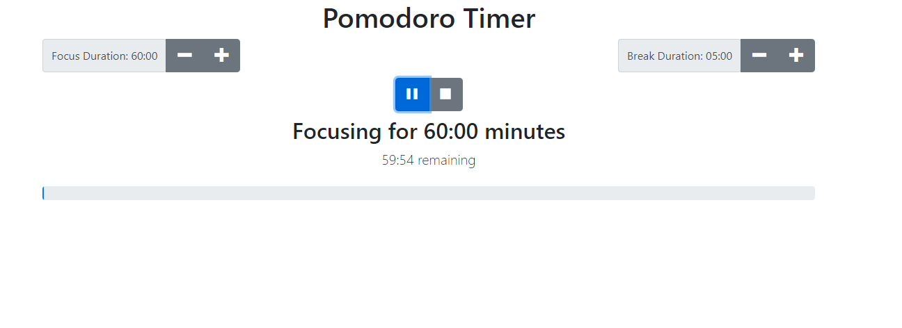

## Pomodoro Timer Project

React project which allows the user to set a timer for themselves. The timer can be adjusted to different intervals and automatically moves to a break after the focusing time is over.

  
  
  
  
  
